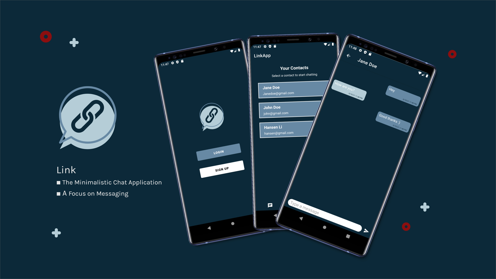
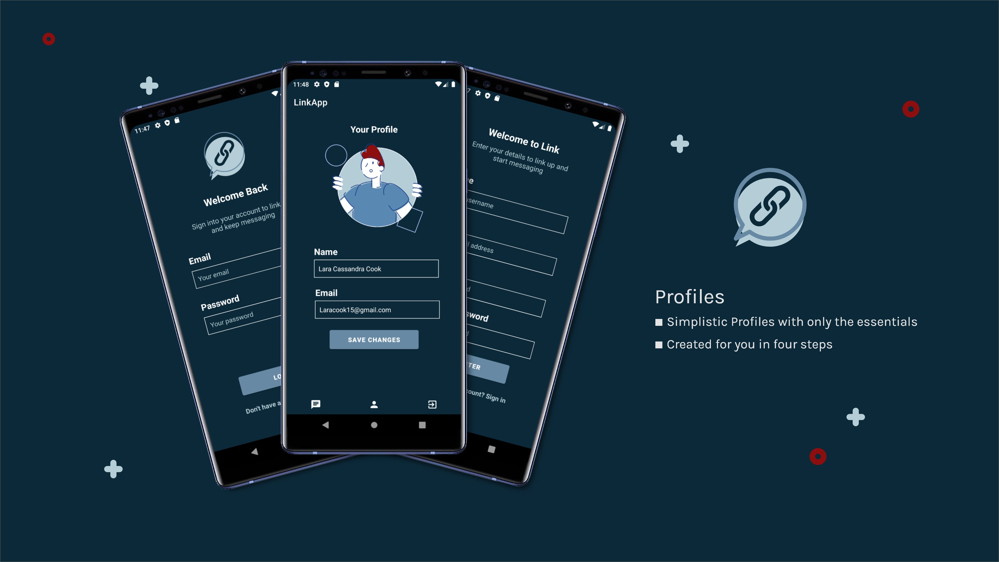
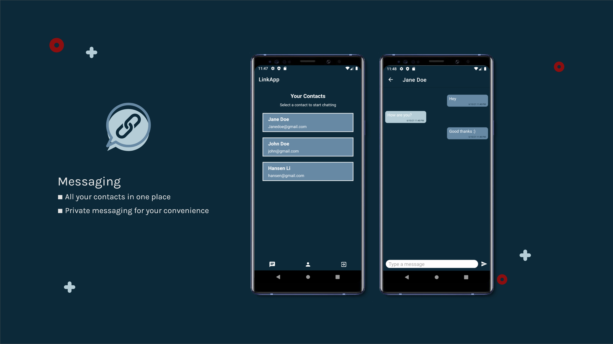
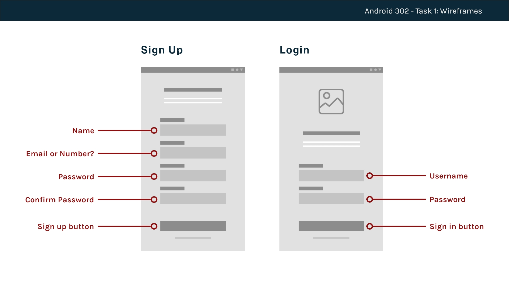
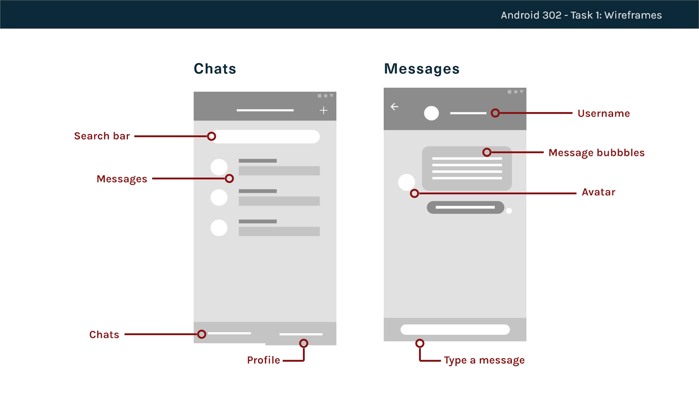
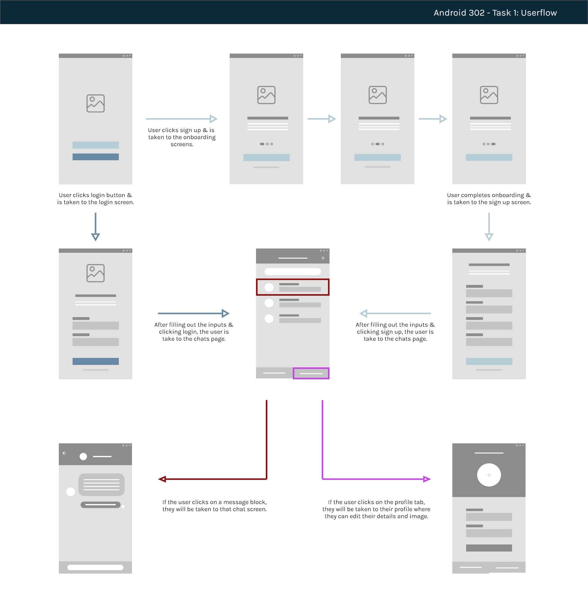

<!--

***
***
*** To avoid retyping too much info. Do a search and replace for the following:
*** LaraCassandra, Link, twitter_handle, 190218@virtualwindow.co.za, project_title, project_description
-->


<!-- PROJECT SHIELDS -->
<!--
*** I'm using markdown "reference style" links for readability.
*** Reference links are enclosed in brackets [ ] instead of parentheses ( ).
*** See the bottom of this document for the declaration of the reference variables
*** for contributors-url, forks-url, etc. This is an optional, concise syntax you may use.
*** https://www.markdownguide.org/basic-syntax/#reference-style-links
-->


<!-- PROJECT LOGO -->
<br />
<p align="center">
  <a href="https://github.com/LaraCassandra/Link">
    
  </a>

  <h3 align="center">Link</h3>

  <p align="center">
    A Mimimalistic Chat Application with a Focus on Messaging
    <br />
    <a href="https://github.com/LaraCassandra/Link"><strong>Explore the docs »</strong></a>
    <br />
    <br />
</p>


<!-- TABLE OF CONTENTS -->
<details open="open">
  <summary><h2 style="display: inline-block">Table of Contents</h2></summary>
  <ol>
    <li>
      <a href="#about-the-project">About The Project</a>
      <ul>
        <li><a href="#built-with">Built With</a></li>
      </ul>
    </li>
    <li>
      <a href="#getting-started">Getting Started</a>
      <ul>
        <li><a href="#prerequisites">Prerequisites</a></li>
        <li><a href="#installation">Installation</a></li>
      </ul>
    </li>
    <li><a href="#features-and-functions">Features and Functions</a></li>
    <li><a href="#concept-process">Concept Process</a>
      <ul>
        <li><a href="#wireframes">Wireframes</a></li>
        <li><a href="#userflow-diagram">Userflow Diagram</a></li>
        <li><a href="#entity-relationship-diagram">Entity Relationship Diagram</a></li>
      </ul>
    </li>
    <li><a href="#development-implementation">Development Implementation</a></li>
    <li><a href="#peer-reviews">Peer Reviews</a>
      <ul>
        <li><a href="#feedback">Feedback</a></li>
        <li><a href="#future-changes">Future Changes</a></li>
      </ul></li>
    <li><a href="#demonstration-video">Demonstration Video</a></li>
    <li><a href="#usage">Usage</a></li>
    <li><a href="#roadmap">Road Map</a></li>
    <li><a href="#contributing">Contributing</a></li>
    <li><a href="#authors">Authors</a></li>
    <li><a href="#contact">Contact</a></li>
    <li><a href="#license">License</a></li>
    <li><a href="#acknowledgements">Acknowledgements</a></li>
  </ol>
</details>


<!-- ABOUT THE PROJECT -->
## About The Project

<br>



<br>

As of last year, WhatsApp released a new policy statement which made people outrage. Users were were extremely unhappy, which opened a gap in the market for a new chatting application. 

Thats where Link comes in.
A mimimalistic linking up applcation that puts a special focus on messaging. 

### Built With

Link is an android application built using:

* [Kotlin](https://kotlinlang.org/) Language
* [Android Studio](https://developer.android.com/studio) as IDE
* [Github](https://github.com/) for Git Version Control
* [Firebase](https://firebase.google.com/?gclid=Cj0KCQjwk4yGBhDQARIsACGfAetw2semTeMyKUR_V4_4KP4ZSsXBfaS2fkX8aj9BrC3URQS1MViuZv0aAifyEALw_wcB&gclsrc=aw.ds) for authentication and database management

<br>

<!-- GETTING STARTED -->
## Getting Started

Let's get started, simply follow the steps below and you'll have your own copy up and running to do with whatever your heart may desire.


### Prerequisites

This project requires that you have the latest version of Android Studio, but no worries, you can [download Android Studio here](https://developer.android.com/studio)!

### Installation

There are a few ways you can go about cloning this repo, check it out:

<br>

1. Git
   ```sh
   git clone https://github.com/LaraCassandra/Link.git
   ```

Once you've clone the repo, just open up Android Studio and select `File -> Open`, this will open a file explorer so just find the project directory and click the `open` button.

<br>

2. Android Studio

You can open the project straight from Android Studio by selecting `File -> New -> Project from Version Control`. Make sure you have Git selected on the dropdown, place the link in the URL field and click `Clone`.

```sh
https://github.com/LaraCassandra/Link.git
```

<br>

<!-- FEATURES AND FUNCTIONS -->
## Features and Functions

### Profiles
When signing up to link, your profile is automatically created with only the bare neccessities and the ability to change your details at any point.


<br>
<br>

### Messaging
All of your contacts are reachable in one place, this minimalistic design helps your focus on what you really want - to link up with your friends.


<br>
<br>


<!-- CONCEPT PROCESS -->
## Concept Process

### Ideation

The ideation phase begins with different tasks to get a good idea of what the application could become. These tasks include:
- Research
- Moodboards
- Creating the Theme and Colour Palette

<br>

### Wireframes





<br>
<br>

### Userflow



<br>
<br>

### Entity Relationship Diagram


<br>
<br>

## Development Implementation

### Functionality
This project makes use of:
- `Fragments` to display views on our screens with framelayouts
- `Relative`, `Linear`, `Containers` and `Frame` layouts to create and allow views to be displayed
- `Recycler View` to easily and dynamically populate items - such as contact lists or messages.
- `Constants` to hold the signed in user's information
- `Firebase` to save the user data and messages into a database

<br>

## Peer Reviews

In week 7, we were able to get **valuable** feedback from our lecturer and peers in order to improve the project

### Feedback
- The overall theme was taken to positively because of the blues
- The imagery (the illustrations) suits the theme
- Suggestion to change the background to be lighter (I did not change it as I liked the navy)

### Future Changes
- Add more depth to the profiles (such as profile pictures, bio's, etc.)
- Improve the overall design and implement responsiveness to fit all screens
- Create the ability to change between light mode and dark mode and make more use of the lighter blues
- Image and emoji implementation for sending messages
- Add group chats

<br>

## Video Demonstration

[Download Demo](https://github.com/LaraCassandra/QuizBee/blob/main/images/LaraCook_190218_Android302_Demo.mp4)

<br>

<!-- USAGE EXAMPLES -->
## Usage

Use this space to show useful examples of how a project can be used. Additional screenshots, code examples and demos work well in this space. You may also link to more resources.

_For more examples, please refer to the [Documentation](https://example.com)_

<br>


<!-- ROADMAP -->
## Roadmap

See the [open issues](https://github.com/LaraCassandra/Link/issues) for a list of proposed features (and known issues).


<!-- CONTRIBUTING -->
## Contributing

Contributions are what make the open source community such an amazing place to be learn, inspire, and create. Any contributions you make are **greatly appreciated**.

1. Fork the Project
2. Create your Feature Branch (`git checkout -b feature/AmazingFeature`)
3. Commit your Changes (`git commit -m 'Add some AmazingFeature'`)
4. Push to the Branch (`git push origin feature/AmazingFeature`)
5. Open a Pull Request

<!-- AUTHORS -->
## Authors
Lara Cook - [https://github.com/LaraCassandra](https://github.com/LaraCassandra)

<br>

<!-- CONTACT -->
## Contact

Lara Cook | 190218

190218@virtualwindow.co.za

Project Link: [https://github.com/LaraCassandra/Link](https://github.com/LaraCassandra/Link)

<br>

<!-- LICENSE -->
## License

Distributed under the MIT License. See `LICENSE` for more information.


<!-- ACKNOWLEDGEMENTS -->
## Acknowledgements

* [Android Documentation](https://developer.android.com/docs)
* [Firebase Documentation](https://firebase.google.com/docs?authuser=0)
* [Kotlin Documentation](https://kotlinlang.org/docs/home.html)
* [Flat Icon](https://www.flaticon.com/)
* [Freepik](https://www.freepik.com/)
* [Drawit.io](https://www.drawkit.io/)
* [Canva](https://www.canva.com/)
* [Kotlin Messaging Tutorials](https://www.youtube.com/watch?v=uB7WeED1d1w&list=PLB6lc7nQ1n4h5tzT3tu_YSy9VNrVUR_4W)


<!-- MARKDOWN LINKS & IMAGES -->
<!-- https://www.markdownguide.org/basic-syntax/#reference-style-links -->
[contributors-shield]: https://img.shields.io/github/contributors/LaraCassandra/repo.svg?style=for-the-badge
[contributors-url]: https://github.com/LaraCassandra/repo/graphs/contributors
[forks-shield]: https://img.shields.io/github/forks/LaraCassandra/repo.svg?style=for-the-badge
[forks-url]: https://github.com/LaraCassandra/repo/network/members
[stars-shield]: https://img.shields.io/github/stars/LaraCassandra/repo.svg?style=for-the-badge
[stars-url]: https://github.com/LaraCassandra/repo/stargazers
[issues-shield]: https://img.shields.io/github/issues/LaraCassandra/repo.svg?style=for-the-badge
[issues-url]: https://github.com/LaraCassandra/repo/issues
[license-shield]: https://img.shields.io/github/license/LaraCassandra/repo.svg?style=for-the-badge
[license-url]: https://github.com/LaraCassandra/repo/blob/master/LICENSE.txt
[linkedin-shield]: https://img.shields.io/badge/-LinkedIn-black.svg?style=for-the-badge&logo=linkedin&colorB=555
[linkedin-url]: https://linkedin.com/in/LaraCassandra
